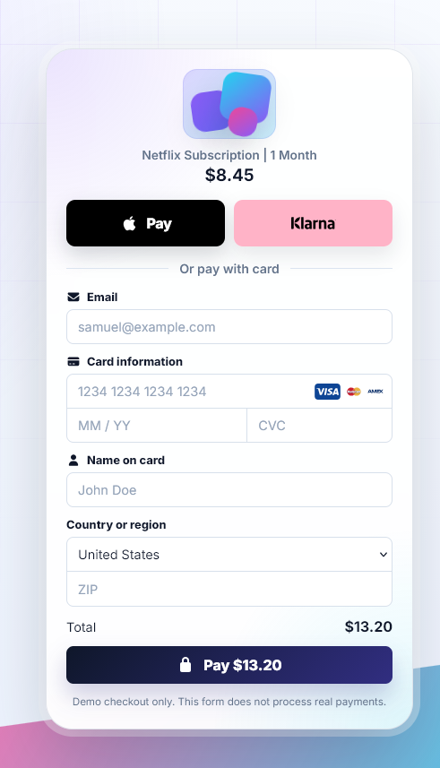
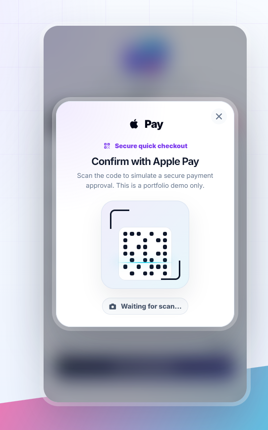
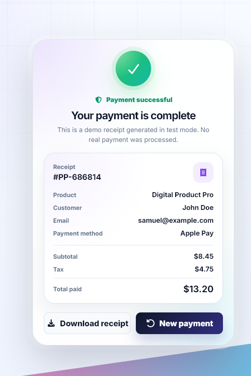

# PulsePay Checkout


A modern Stripe-inspired checkout UI concept built with **React**, **TypeScript** and **Vite**.


PulsePay is a fictional payment form created as a frontend portfolio project. It focuses on clean UI, smooth payment states, responsive design and premium fintech-inspired interactions.





## Live Demo


[View Live Demo](https://pulsepay-checkout.vercel.app/)


## Features


* Modern Stripe-inspired payment form

* Apple Pay and Klarna quick-pay options

* Animated QR-code approval flow

* Simulated camera flash payment confirmation

* Card payment form with validation

* Visa, Mastercard and American Express card brand icons

* Processing and successful payment states

* Receipt view after completed payment

* Responsive desktop and mobile layout

* Premium glassmorphism and gradient background

* Built as a fictional portfolio/demo checkout


## Screenshots


### Payment Form


### Apple Pay Approval Flow





### Successful Payment Receipt





## Tech Stack


* React

* TypeScript

* Vite

* CSS

* Font Awesome

* SVG payment assets


## Project Purpose


PulsePay was built to practice and showcase modern frontend development with a focus on:


* Component-based React architecture

* TypeScript types and state management

* Form validation

* Conditional rendering

* UI animations

* Responsive design

* Clean fintech/SaaS-inspired visual design


## Demo Payment Flow


This project does not process real payments.


The checkout includes simulated flows for:


* Card payment

* Apple Pay

* Klarna


The Apple Pay and Klarna buttons open a fake approval overlay with a QR-code scan animation. After the animation completes, the UI switches to a generated receipt screen.


## Getting Started


Clone the repository:


```bash

git clone https://github.com/samme-commit/pulsepay-checkout.git

```


Navigate into the project:


```bash

cd pulsepay-checkout

```


Install dependencies:


```bash

npm install

```


Start the development server:


```bash

npm run dev

```


Build for production:


```bash

npm run build

```


## Folder Structure


```text

src/

├─ assets/

│  └─ payment/

│     ├─ amex.svg

│     ├─ klarna.svg

│     ├─ mastercard.svg

│     └─ visa.svg

├─ components/

│  ├─ PaymentForm/

│  ├─ QuickPayOverlay/

│  └─ ReceiptView/

├─ App.css

├─ App.tsx

├─ index.css

└─ main.tsx

```


## Disclaimer


This is a fictional checkout UI concept created for learning and portfolio purposes.


PulsePay does not process real payments, store payment details or connect to Apple Pay, Klarna, Stripe or any other payment provider.


For real payment processing, use official providers such as Stripe Checkout, Stripe Elements or other certified payment solutions.


## Author


Built by Samuel as part of a React and TypeScript portfolio.


